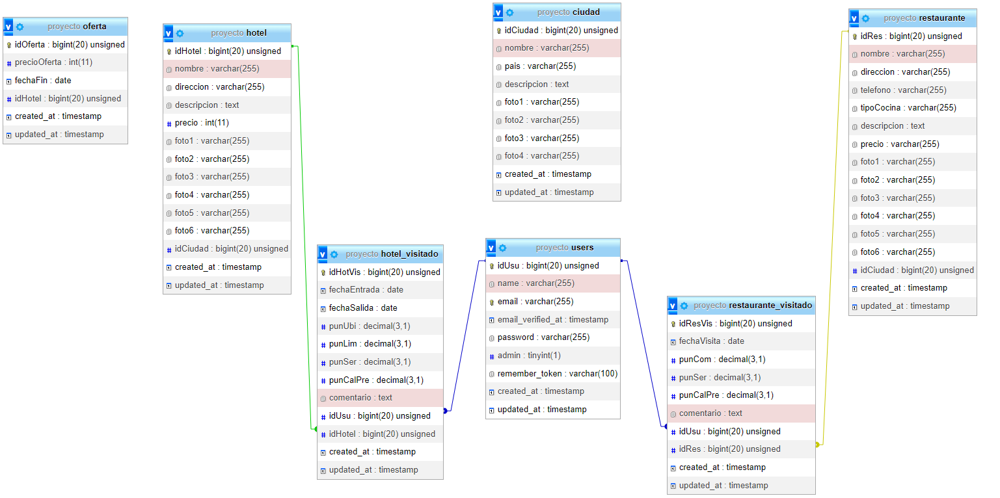

<h3 align="center"> TravelFree </h3>

 TravelFree es una aplicación web de viajes que permite a los usuarios buscar hoteles y restaurantes de los lugares que quieran visitar de manera fácil y sin complicaciones. También los usuarios pueden guardar información de los destinos que han visitado. 

## Funcionalidades de la aplicación

<h4>Página principal</h4>

- Mostrar al usuario ofertas especiales para ciertos lugares.
- Buscar ciudades y mostrar los hoteles y restaurantes disponibles con sus respectivas informaciones.
- Consulta de las últimas búsquedas.

<h4>Usuarios registrados</h4>

- Hoteles visitados: listas de todas sus reseñas en distintos hoteles que puede añadir, modificar o eliminarlas.
- Restaurantes visitados: listas de todas sus reseñas en distintos restaurantes que puede añadir, modificar o eliminarlas.
- Opiniones: se muestran todos los comentarios realizados en hoteles y restaurantes.
- Puede modificar su perfil de usuario y su contraseña.
  
<h4>Administrador</h4>

- Ver todos los usuarios registrados.
- Puede añadir y editar las ciudades, ofertas, hoteles y restaurantes.

## Tecnologías
- Laravel
- PHP
- Amazon Web Services
- MySQL
- Tailwind CSS
- CSS3
- JavaScript
- Figma

## Prototipo figma
 [Ver prototipo](https://www.figma.com/proto/F0bzfzMPLN13VJRvaO8vN8/Prototipo-provisional?node-id=1-2&scaling=scale-down)

## Estructura Base de Datos

## Vídeo explicativo
[Ver vídeo](https://drive.google.com/file/d/1MP0sjv3f-pVadY5xFihCZz7HMnoZzf6j/view?usp=sharing)

## Histórico de tareas
En los [commits](https://github.com/mariasnchez/travelFree/commits/main) se reflejan los cambios.

## Bibliografía
https://laravel.com/docs  
https://www.php.net/docs.php  
https://docs.aws.amazon.com/  
https://tailwindcss.com/docs  
https://developer.mozilla.org/en-US/docs/Web/JavaScript  
Tutoriales de youtube 
